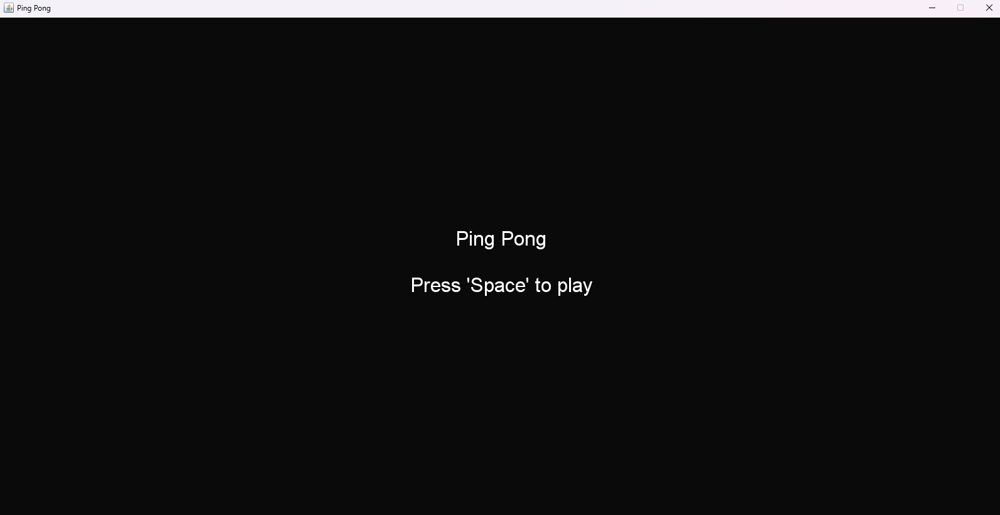
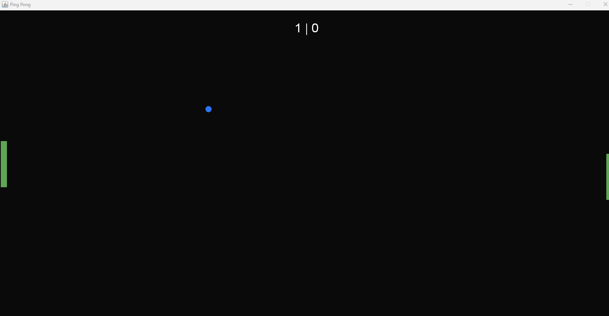

<div align="center">
    <h1>Ping Ping</h1>
</div>

<p align="center">
    
    <a href="https://discord.gg/BwSuTdEGJ4" style="text-decoration: none;">
         
    </a>
    
    
    
</p>

Classic implementation of the game "Ping Pong". The game has the sound of collision with walls/player, states (menu, win, lose, play), primitive "AI".

## Demo





## Controls
* <kbd>Mouse</kbd> - gaming platform movement
* <kbd>Space</kbd> - start a new game

## Installation
To run the Ping Ping project on your local machine, follow these steps:

Clone the Repository:

```bash
git clone https://github.com/Deknil/PingPong.git
```

Navigate to the Project Directory:

```bash
cd PingPong
```

Compile and Run the Application:

```bash
javac Main.java
java Main
```

## How to Contribute

We welcome contributions from the community! If you'd like to contribute to the Ping Ping project, please follow these steps:
1. **Fork the Repository**: Click the "Fork" button in the upper right corner of the repository's page to create your copy of the project.
2. **Create a Branch**: Create a new branch for your work. Name it descriptively, related to the task or feature you intend to implement.
3. **Make Changes**: Make the necessary changes to the code, fix bugs, or add new features.
4. **Testing**: Before submitting a pull request, ensure that your code passes all existing tests and does not introduce new issues.
5. **Submit a Pull Request (PR)**: Once you have completed your work, submit a pull request to the original repository. Make sure to describe your changes and their purpose in the PR.
6. **Discussion and Review**: Your changes will be discussed and reviewed by project members. There may be requests for further improvements if needed.
7. **Merge**: After successful review and approval of your PR, your code will be merged into the main project repository.
8. **Acknowledgment**: Your contribution will be recognized and appreciated. Thank you for your participation!

## License
This project is licensed under the `MIT License`. You are free to use, modify and redistribute this project under the terms of the specified license.